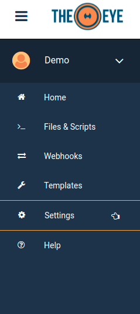
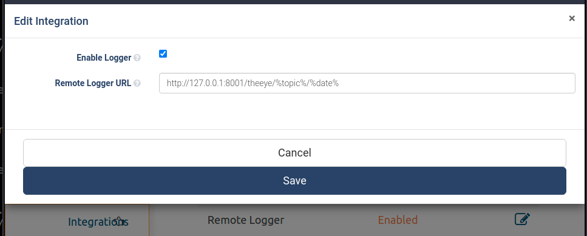
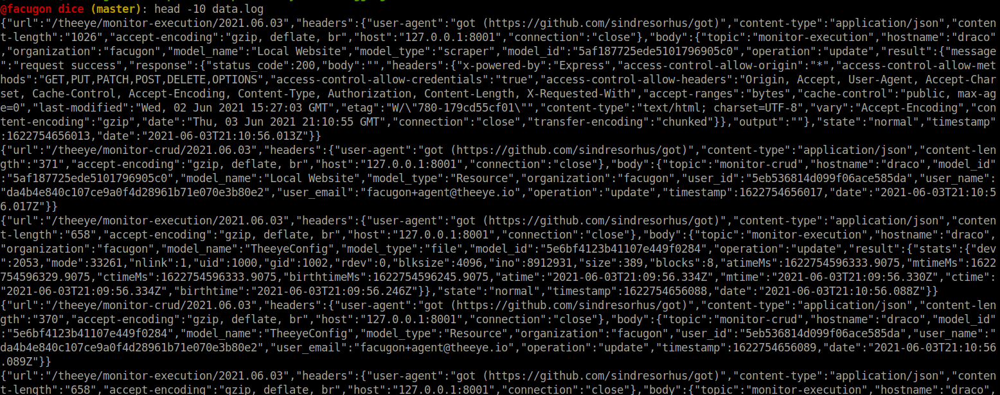
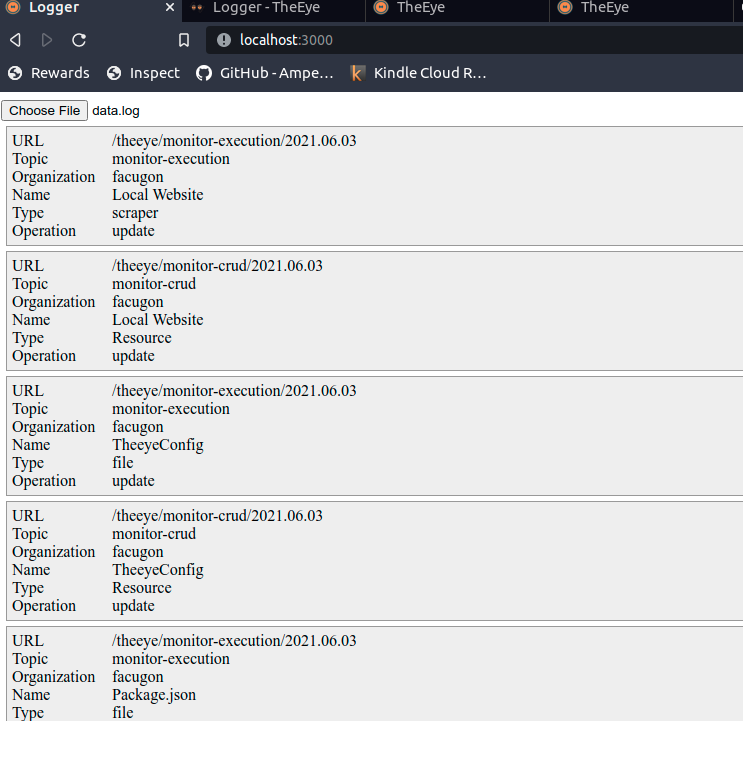

# Theeye Integrations

[](https://theeye.io/en/index.html)

## TheEye Logger Integration

Esta integración permite activar, en cada Organización, el envio de la información generada por los eventos internos de TheEye, hacía una Api externa.

Para activar el envio de eventos hacía una API se debe ingresar al panel de TheEye e ir al menu de Integraciones.




Una vez seleccionada la opción "Integrations" se debe activar el "Remote Logger"





La URL admite dos parámetros opcionales, que pueden ser colocados en cualquier orden y en cualquier parte del a URL, y son reemplazados luego por el valor correspondiente a cada evento.

| Nombre | Descripcion |
| ----- | ------ |
| %topic% | Nombre del evento emitido. [Lista completa de eventos](/core-concepts/events/)|
| %date% | Fecha actual en formato YYYY.MM.DD |

------

## Sample integrations.

### Rest API with NodeJS

[https://github.com/theeye-io/theeye-logger-server-nodejs](https://github.com/theeye-io/theeye-logger-server-nodejs)

El codigo de ejemplo se encuentra en este repositorio GitHub.

```
git clone git@github.com:theeye-io/theeye-logger-server-nodejs.git
```

seguir el README para iniciar.

Una vez iniciado el servicio, comenzaran a recibir los eventos por consola.


Los eventos recibidos son almacenados en el archivos data.log. Cada linea es un JSON con la información recibida.



Tambien hay una interfaz reducida y facil de adaptar para visualizar facilmente parte de la información de los eventos.



-----
