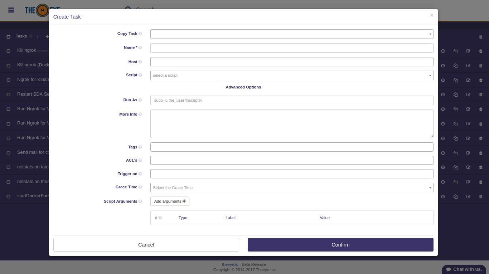
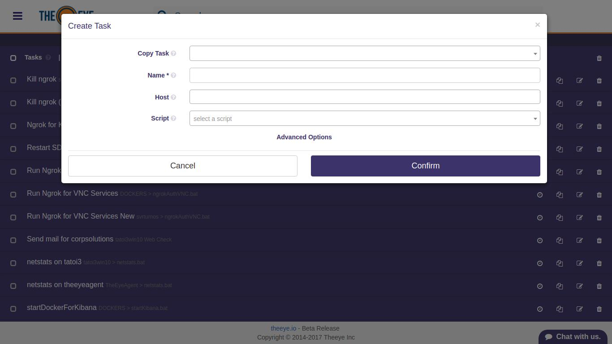

# Tasks

## Tasks Documentation

### Contents

* Create and modify tasks
  * [Approval Task](./#approval-task)
  * [Input Task](./#input-task)
  * [Script Task](./#create-a-script-task)
  * [Webhook or HTTP Request Task](./#create-an-endpoint-apiweb-task)
* [Task Management and Scheduler](./#schedule-a-task)

### Create and modify tasks

Creating a task is simple, just go to the tasks section in the left "hamburger" menu, and click on "+ create New Task", select the task category from _Outgoing Webhook/HTTP Request_ and _Script_ and start writing your task. A task can be modified directly from the tasks' panel in the Dashboard or you can go to the tasks page in the left menu, and click the edit button over the task row.

You can also create tasks from the dashboard by clicking on the "+" button: 

### Approval Task

Approval tasks handle approval requests in workflows. As breakpoints do, an approval task will pause the workflow execution until it is approved or rejected.

### Input Task

An input task is a special task commonly used to start workflows. When executed, the input parameters will be submitted directly to the next chained task in the workflow.

#### Script task.

Use the quick input mode  or click on "advanced options" for further features. 

* **Copy Task**: select an already created task as template
* **Name**: name your task
* **Host**: select the host where the script will run
* **Script**: select the script to be executed by the task
* **Run As**: write down any extra command needed for user impersonification
* **More Info**: describe your task. What does it do, what's the expected output after execution
* **Tags**: tag your task so you can find quickly through the application.
* **ACL's**: select who can view your task \(what can be done with the task depends on the user role\)
* **Trigger on \(**_**Triggered by**_**\)**: If the task is part of a workflow, select what triggers the task. The task will be triggered by the resource you selected here.
* **Grace Time**: enter the time period TheEye should wait before running the task. _No wait / Cancelation_ can be selected which means the task will run inmediately after triggered. \(only applicable for triggered tasks\). **To cancel the task execution during the grace period, go to tasks panel, expand the task and delete the schedule created by the trigger.**
* **Script Arguments**: If the script played by the task is meant to receive parameters you can set them from here. Mind the order as it will be used by the script. _Fixed_, _options_, and _input_ arguments are allowed. _Input_ and _options_ arguments will be asked to the user for execution. _Fixed_ arguments will not be displayed to the user at execution time.

#### Create an endpoint API/WEB task.

Select _Outgoing Webhook/HTTP Request_ on "+ create New Task" dialog to create tasks based on HTTP requests. 

The main difference between a _Script_ task relies on:

* **URL**: This is the endpoint URL for the request. If GET or POST method is used, the querystring must be provided \(E.g. [https://www.mysite.com?foo=foo&bar=bar](https://www.mysite.com?foo=foo&bar=bar)\)
* **Method**:  HTTP method \(GET, POST, PUT, DELETE, etc\)
* **JSON Body**: Only JSON data is accepted as a request body, if checked, the next _Request Body_ field will be used.
* **Request Body**: Provide the JSON data to be used as the request body.
* **Use HTTP Compression**: HTTP Compression flag.
* **Req. Timeout**:  The time to wait for response before considering the request has failed.
* **Success Status Code**: The HTTP code expected at response to consider it successful. Ref. [https://www.w3.org/Protocols/rfc2616/rfc2616-sec10.html](https://www.w3.org/Protocols/rfc2616/rfc2616-sec10.html)
* **Success Pattern**:  Expected HTTP body response. You can write plain HTML code or you can use a _Regular Expression_.

### Schedule a task.

You can use the task scheduler to create and manage tasks that TheEye will carry out automatically at the times you specify. To view or perform an operation, go to the _Tasks_ section and click on the scheduler icon.

